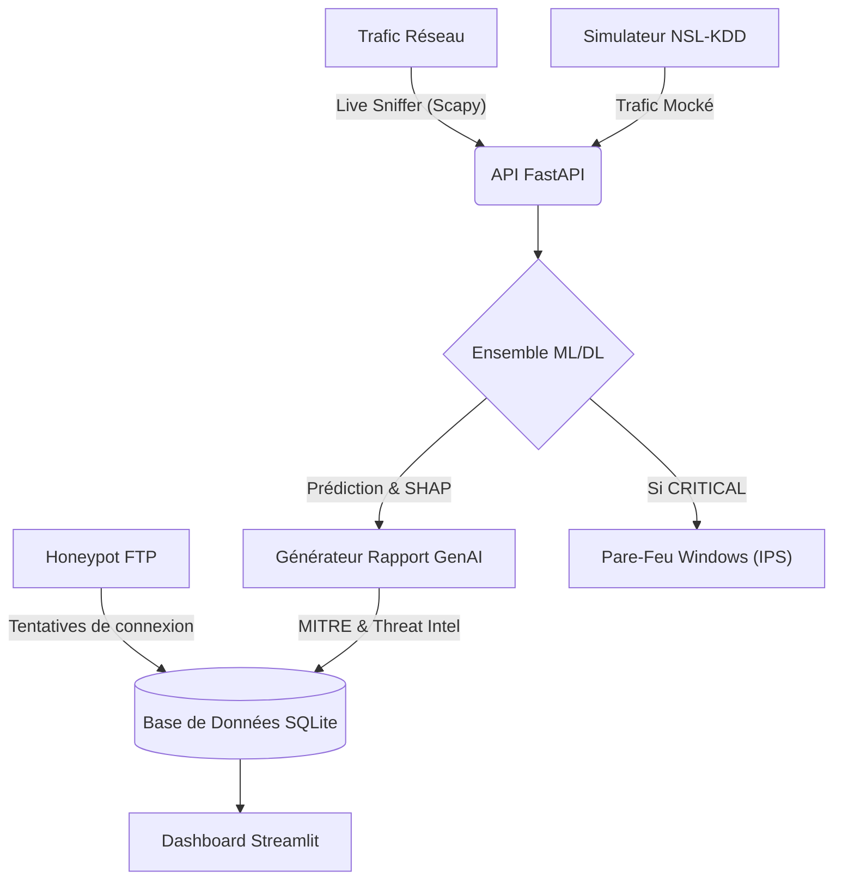

# 🛡️ CyberShield SOC (V3 Ultimate)
**AI-Powered Security Operations Center & Intrusion Prevention System (IPS)**


CyberShield est un Centre Opérationnel de Sécurité (SOC) intelligent de bout en bout. Il remplace les règles statiques traditionnelles par une architecture **Ensemble Learning** combinant Machine Learning classique et Deep Learning (Autoencodeurs) pour détecter, expliquer, et bloquer les cyberattaques en temps réel.

---

## ✨ Fonctionnalités Principales

- 🧠 **Détection par Ensemble Learning** : Vote pondéré entre 4 algorithmes (Random Forest, XGBoost, DNN, LSTM-Autoencoder) assurant une très haute précision.
- 🕵️‍♂️ **Intelligence Explicable (XAI)** : Intégration de SHAP pour justifier mathématiquement chaque décision de l'IA.
- 🤖 **Copilote GenAI Analyste** : Un LLM simulé rédige un rapport forensique détaillé pour chaque alerte, classifiant la menace selon le framework **MITRE ATT&CK**.
- ⚔️ **Mitigation Active (Mode IPS)** : L'IA bloque les menaces critiques de façon autonome via le Pare-feu Windows.
- 🌍 **Cartographie Mondiale (Threat Map 3D)** : Suivi en temps réel de la provenance des attaques grâce à l'API GeoIP publique `ip-api.com`.
- 🍯 **Honeypot FTP Actif** : Piège logiciel simulant un service vulnérable pour intercepter et bannir immédiatement tout scanner réseau malveillant.
- 📂 **Batch Forensics (PCAP / CSV)** : Upload de fichiers de captures réseaux (`.pcap`) ou de logs offline pour les passer au crible de l'IA Forensique.
- 📊 **Intelligence de Filtrage** : Le Dashboard sépare intelligemment les données de simulation des véritables attaques interceptées en direct.

---

## 🛠️ Architecture du Système



---

## 🚀 Installation

### Prérequis
1. **Python 3.8+**
2. (Windows uniquement) **Npcap** : Nécessaire pour l'écoute du trafic en direct. À télécharger sur [npcap.com](https://npcap.com/#download) (Cochez "Install Npcap in WinPcap API-compatible Mode"). *Si vous avez Wireshark, c'est déjà installé.*

### Déploiement
1. Clonez ce dépôt :
   ```bash
   git clone https://github.com/Raphyabre/SOC-INTELLIGENT-.git
   cd SOC-INTELLIGENT-
   ```
2. Créez un environnement virtuel et installez les dépendances :
   ```bash
   python -m venv .venv
   .venv\Scripts\activate
   pip install -r requirements.txt
   ```

---

## 🖥️ Utilisation

Pour lancer le SOC complet (API + Dashboard), exécutez le script d'orchestration **en tant qu'Administrateur** (requis pour la mitigation active IPS) :

Double-cliquez sur : `run_soc.bat` (Clic Droit -> Exécuter en tant qu'administrateur).
Ou sur un portail web d'administration en mode local (Dashboard) accessible à : `http://localhost:8501`. Utilisez les identifiants : `admin` / `soc_admin_2026`.

### Contrôle des Sondes et Outils
Une fois le Dashboard ouvert dans votre navigateur :
- Allez dans le panneau latéral de gauche.
- Cliquez sur **🔴 Simu** pour lancer une vague d'attaque synthétique (idéal pour les démos).
- Cliquez sur **🔵 Live** pour brancher l'IA sur votre propre carte réseau.
- Cliquez sur **🍯 Déployer Honeypot (FTP)** pour lancer le piège logiciel sur le port 21.
- Naviguez vers l'onglet **📂 Batch Forensics** pour analyser un fichier `.pcap` ou `.csv` (un fichier généré `test_attack.pcap` est disponible à la racine du projet).

---

## 🧹 Nettoyage 
L'IA bloquant activement les IP malveillantes dans votre pare-feu, vous pouvez remettre votre système à zéro à tout moment :
1. Faites un clic droit sur `clean_firewall.bat`
2. **Exécuter en tant qu'administrateur**

---
*Projet d'Intelligence Artificielle appliquée à la Cybersécurité.*
